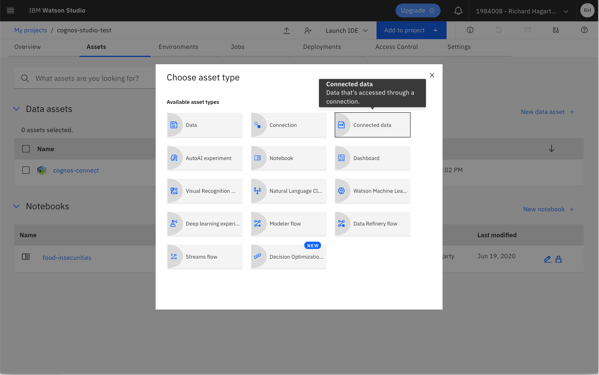
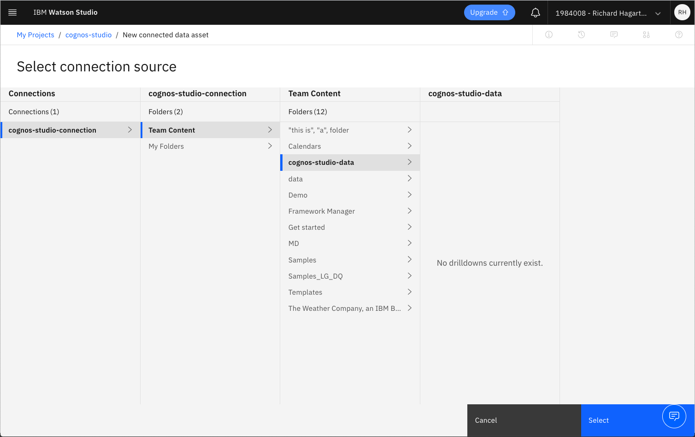
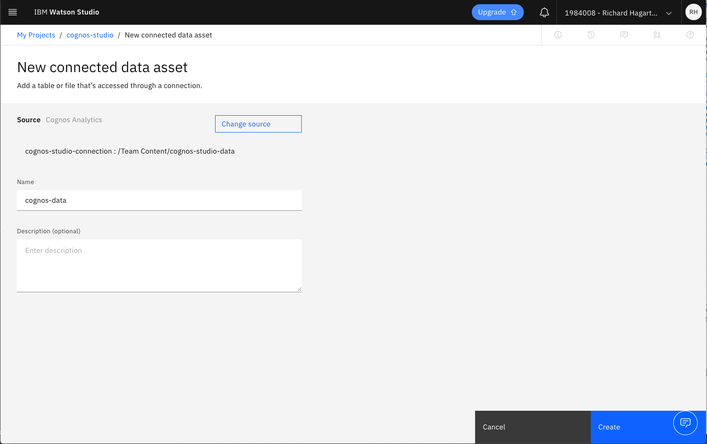

# Visualize Food Insecurity with Watson Studio and Cognos Analytics

This code pattern showcases the integration between Watson Studio and Cognos Analytics by guiding the user through an examination of data related to a growing problem in the United States, the issue of food insecurites and its associated factors.

Often in data science we do a great deal of work to glean insights that have an impact on society or a subset of it and yet, often, we end up not communicating our findings or communicating them ineffectively to non data science audiences. That's where visualizations become the most powerful. By visualizing our insights and predictions, we, as data scientists and data lovers, can make a real impact and educate those around us that might not have had the same opportunity to work on a project of the same subject. By visualizing our findings and those insights that have the most power to do social good, we can bring awareness and maybe even change. This Code Pattern walks you through how to do just that, with IBM's Watson Studio, Pandas, and Cognos Analytics.

For this particular Code Pattern, the focus is on food insecurity throughout the US. Low access, diet-related diseases, race, poverty, geography and other factors are considered by using open government data. For some context, this problem is a more and more relevant problem for the United States as obesity and diabetes rise and two out of three adult Americans are considered obese, one third of American minors are considered obese, nearly ten percent of Americans have diabetes and nearly fifty percent of the African American population have heart disease. Even more, cardiovascular disease is the leading global cause of death, accounting for 17.3 million deaths per year, and rising. Native American populations more often than not do not have grocery stores on their reservation... and all of these trends are on the rise. The problem lies not only in low access to fresh produce, but food culture, low education on healthy eating as well as racial and income inequality.

The government data that is used in this Code Pattern has been conveniently combined into a dataset for our use, which you can find in this repo under combined_data.csv.zip. You can find the original, government data from the [US Bureau of Labor Statistics](https://www.bls.gov/cex) and [The United States Department of Agriculture](https://www.ers.usda.gov/data-products/food-environment-atlas/data-access-and-documentation-downloads/).


## Flow

1. Full data set is loaded into Cognos Analytics.
1. User runs Jupyter notebook in Watson Studio
1. Data from Cognos Analytics is loaded into Jupyter notebook.
1. Jupyter notebook is run to create a refined data set that is pushed back into Cognos Analytics.
1. User runs Cognos Analytics to visualize new data set.

## Included Components

* [Cognos Analytics](https://www.ibm.com/products/cognos-analytics): A business intelligence solution that empowers users with AI-infused self-service capabilities that accelerate data preparation, analysis, and repot creation.
* [IBM Watson Studio](https://dataplatform.cloud.ibm.com): Analyze data using RStudio, Jupyter, and Python in a configured, collaborative environment that includes IBM value-adds, such as managed Spark.
* [IBM Cloud Object Storage](https://cloud.ibm.com/catalog/services/cloud-object-storage): An IBM Cloud service that provides an unstructured cloud data store to build and deliver cost effective apps and services with high reliability and fast speed to market.
* [Jupyter Notebooks](https://jupyter.org/): An open-source web application that allows you to create and share documents that contain live code, equations, visualizations and explanatory text.
* [pandas](https://pandas.pydata.org/): A Python library providing high-performance, easy-to-use data structures.

## Steps

1. [Clone the repo](#1-clone-the-repo)
1. [Upload data file into Cognos Analytics](#2-upload-data-file-into-cognos-analytics)
1. [Create a new Watson Studio project](#3-create-a-new-watson-studio-project)
1. [Create a Cognos Analytics connection in Watson Studio](#4-create-a-cognos-analytics-connection-in-watson-studio)
1. [Add Cognos Analytics data asset to Watson Studio project](#5-add-cognos-analytics-data-asset-to-watson-studio-project)
1. [Create data access token](#6-create-data-access-token)
1. [Create the notebook in Watson Studio](#7-create-the-notebook-in-watson-studio)
1. [Add data to the notebook](#8-add-data-to-the-notebook)
1. [Run the notebook](#9-run-the-notebook)
1. [Refine the data](#10-refine-the-data)
1. [Write out data using Cognos Analytics connection](#11-write-out-data-using-cognos-analytics-connection)
1. [Visualize the data in Cognos Analytics](#12-visualize-the-data-in-cognos-analytics)

## 1. Clone the repo

```bash
git clone https://github.com/IBM/cognos-analytics-with-watson-studio.git
```

## 2. Upload data file into Cognos Analytics

* From the data directory in your local repo, unzip the file `combined_data.csv.zip` to extract the file `combined_data.csv`.

* Log into IBM's [Cognos Analytics](https://www.ibm.com/products/cognos-analytics).

* From the Cognos Analytics main dashboard, select the `+` icon in the lower left corner and select `Upload files`.

* From the file selection dialog, select the extracted csv file. In this example, the file has been loaded into the `cognos-studio-data` folder.

  

## 3. Create a new Watson Studio project

* Log into IBM's [Watson Studio](https://dataplatform.cloud.ibm.com). Once in, you'll land on the main dashboard.

* Create a new project by clicking `New project +` and then click on `Create an empty project`.

* Enter a project name.

* Choose an existing Object Storage instance or create a new one.

* Click the `Create` button.

Upon a successful project creation, you are taken to the project Overview tab. Take note of the Assets and Settings tabs, we'll be using them to associate our project with any external assets (datasets and notebooks) and any IBM cloud services.

  

## 4. Create a Cognos Analytics connection in Watson Studio

* From you Watson Studio project dashboard, click `Add to project +`, and select the `Connection` option.

  

* Select `Cognos Analytics` as the data source.

  

* Configure the connection to point to your Cognos Analytics instance. Provide a name for your connection, plus `namespace`, `username/password`, and `URL`.

  

* Click the `Create` button.

## 5. Add Cognos Analytics data asset to Watson Studio project

* From you Watson Studio project dashboard, click `Add to project +`, and select the `Connected data` option.

  

* Click `Select source` to view the available connections.

* From the `Select connection source` panel, select the connection you created in the previous step. Then select the path to the data file on Cognos Analytics.



* Click `Select` to select the connection source path.

* From the `New connected data asset` panel, name the path and click `Create`.



* At this point, you should have a `Connection` and a `Folder Asset` in your list of project assets.


## 6. Create data access token

* From you Watson Studio project dashboard, selected the `Settings` tab.


* Scroll down to the `Access tokens` list, and click on `New token +`.


* Provide a name for your token and set the access level to `Editor`.


* Click the `Create` button.
* To view the token value, select the action menu located on the right-hand side of the token row, and click on `View`.


### 7. Create the notebook in Watson Studio

* From the new project `Overview` tab, click `+ Add to project` on the top right and choose the `Notebook` asset type.

  

* Fill in the following information:

  * Select the `From URL` tab. [1]
  * Enter a `Name` for the notebook and optionally a description. [2]
  * For `Select runtime` select the `Default Python 3.6` option. [3]
  * Under `Notebook URL` provide the following url [4]:

  ```url
  https://raw.githubusercontent.com/IBM/cognos-analytics-with-watson-studio/master/notebooks/diet-related-disease.ipynb
  ```

  

* Click the `Create` button.

  > **TIP:** Your notebook will appear in the `Notebooks` section of the `Assets` tab.

### 8. Add data to the notebook

* After creation, the notebook will automatically be loaded into the notebook runtime environment. You can re-run the notebook at any time by clicking on the `pencil` edit icon displayed in right-hand column of the notebook row.

  

* The second cell of the notebook should be labeled as a `@hidden_cell`. This is where will load in our Cognos Analytics `csv` file.

  >**Note**: This cell is marked as a `@hidden_cell` because it will contain sensitive credentials.

* Use `Find and Add Data` (look for the 01/00 icon) and its `Connection` tab.

* Place your cursor at the bottom of the `@hidden_cell` (indicated by the red arrow), then select `insert to code`, and click on the `pandas DataFrame` option.

  

* The `@hidden_cell` should now contain the access token and data connector that will allow you to load your Cognos Analytics `csv` file.

* Change the name of the DataFrame variable to `df_data_1`, which is the name used in the remaining notebook cells.

* Change the path and file name to point to your Cognos Analytics data.

  

  > **TIP**: To search the data files that your connector points to,  run the following command in the cell:
  >
  >```python
  >CADataConnector.search_data("keyword")
  >```

## 9. Run the notebook

When a notebook is executed, what is actually happening is that each code cell in the notebook is executed, in order, from top to bottom.

Each code cell is selectable and is preceded by a tag in the left margin. The tag format is `In [x]:`. Depending on the state of the notebook, the `x` can be:

* A blank, this indicates that the cell has never been executed.
* A number, this number represents the relative order this code step was executed.
* A `*`, this indicates that the cell is currently executing.

There are several ways to execute the code cells in your notebook:

* One cell at a time.
  * Select the cell, and then press the `Play` button in the toolbar.
* Batch mode, in sequential order.
  * From the `Cell` menu bar, there are several options available. For example, you can `Run All` cells in your notebook, or you can `Run All Below`, that will start executing from the first cell under the currently selected cell, and then continue executing all cells that follow.
* At a scheduled time.
  * Press the `Schedule` button located in the top right section of your notebook panel. Here you can schedule your notebook to be executed once at some future time, or repeatedly at your specified interval.

## 10. Refine the data

The notebook analyzes food insecurity data, and attempts to correlate multiple variables that include public heath, food scarcity, and access to food programs.

General definitions:

* **Food Insecurity** is a measure of the availability of food and an individuals' ability to access it.
* **SNAP** refers to the Supplemental Nutrition Assistance Program that was formerly known as food stamps.
* **WIC** is the Woman, Infant, Children program that provides nutrious foods for expecting mothers, infants and children.

Here are a sampling of the variables used in the notebook and their definitions:

* **PCT_REDUCED_LUNCH10** - Percentage of reduced lunches in schools
* **PCT_DIABETES_ADULTS10** - Percentage of adult population with diabetes
* **PCT_OBESE_ADULTS10** - Percentage of adult population that is obese
* **FOODINSEC_10_12** - Amount of food insecurity
* **PCT_OBESE_CHILD11** - Percentage of children in the population that is obese
* **PCT_LACCESS_POP10** - Percentage of the population lacking access to food
* **PCT_LACCESS_CHILD10** - Percentage of children lacking access to food
* **PCT_LACCESS_SENIORS10** - Percentage of senior citizens lacking access to food
* **SNAP_PART_RATE10** - SNAP Participation Rate
* **PCT_LOCLFARM07**
* **FMRKT13** - Number of food markets
* **PCT_FMRKT_SNAP13** - Number of food markets providing SNAP assistance
* **PCT_FMRKT_WIC13** - Number of food markets providing WIC assistance
* **FMRKT_FRVEG13** - Food markets with vegetables
* **PCT_FRMKT_FRVEG13** - Percentage of markets that offer vegatables
* **PCT_FRMKT_ANMLPROD13** - Percentage of markets that offer animal products
* **FOODHUB12** - Food hubs connect the dots between producers and cosumers of food in local and regional food systems. Currently there are 236 food hubs in the U.S.
* **FARM_TO_SCHOOL**
* **SODATAX_STORES11**
* **GROC12**
* **SNAPS12**
* **WICS12**
* **PCT_NHWHITE10** - Percentage of the poluation that is white
* **PCT_NHBLACK10** - Percentage of the poluation that is black
* **PCT_HISP10** - Percentage of the poluation that is hispanic
* **PCT_NHASIAN10** - Percentage of the poluation that is asian
* **PCT_65OLDER10** - Percentage of the poluation that is 65 or older
* **PCT_18YOUNGER10** - Percentage of the poluation that is 18 or younger
* **POVRATE10** - Poverty Rate
* **CHILDPOVRATE10** - Chile Poverty Rate

Initially, the data is very large and contains irrelevant data. Through a series of explorations, the DataFrame is reduced by eliminating unrelated variables and data where the vales are 0 or undefined.

## 11. Write out data using Cognos Analytics connection

Once we have refined our DataFrame, we can use the connection to write the data back out so that we can visualize it using Cognos Analytics.

In this example, we are writing it out to a file named `focused_data.csv`.


Once complete, you should see the file in your Cognos Analytics instance.


## 12. Visualize the data in Cognos Analytics

## License

This code pattern is licensed under the Apache Software License, Version 2.  Separate third party code objects invoked within this code pattern are licensed by their respective providers pursuant to their own separate licenses. Contributions are subject to the [Developer Certificate of Origin, Version 1.1 (DCO)](https://developercertificate.org/) and the [Apache Software License, Version 2](https://www.apache.org/licenses/LICENSE-2.0.txt).

[Apache Software License (ASL) FAQ](https://www.apache.org/foundation/license-faq.html#WhatDoesItMEAN)
