# Cognos Analytics and Watson Studio: Better together - Credit Risk Analysis Tutorial

This code pattern showcases the integration between Watson Studio and Cognos Analytics by guiding the user through an examination of credit risk related data.

The Data Scientist refines the data and builds a model using Watson Machine Learning. The model is then used to score new credit applications to determine if they are a risk or not. The results are then fed into Cognos Analytics, where a Business Analyst can create visualizations to provide insights about the factors that most influence the credit worthiness of the applicants.

Data is easily transferred between Watson Studio and Cognos Analytics using a feature of Studio called a `Data Connector`. It provides notebooks the ability to read and write data to a Cognos Analytics instance.

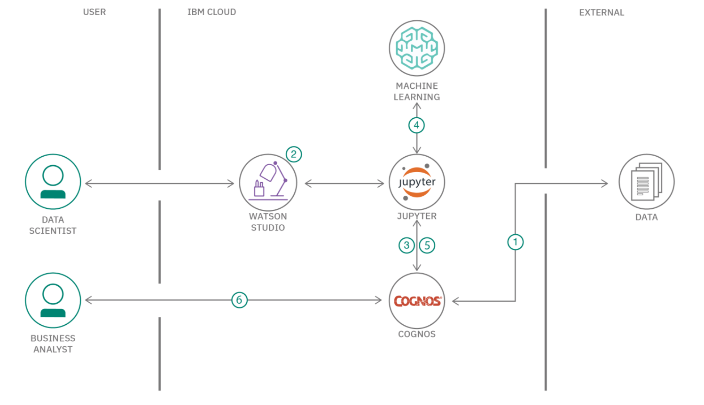

## Flow

1. Credit risk data is loaded into Cognos Analytics.
1. Data Scientist runs Jupyter notebook in Watson Studio.
1. Data from Cognos Analytics is loaded into Jupyter notebook where it is prepared/refined for modeling.
1. Jupyter notebook uses Watson Machine Learning to create a credit risk model.
1. New credit applications are scored against the model and the results are pushed back into Cognos Analytics.
1. Business Analyst runs Cognos Analytics to visualize the results.

## Included Components

* [Cognos Analytics](https://www.ibm.com/products/cognos-analytics): A business intelligence solution that empowers users with AI-infused self-service capabilities that accelerate data preparation, analysis, and repot creation.
* [IBM Watson Studio](https://dataplatform.cloud.ibm.com): Analyze data using RStudio, Jupyter, and Python in a configured, collaborative environment that includes IBM value-adds, such as managed Spark.
* [Jupyter Notebooks](https://jupyter.org/): An open-source web application that allows you to create and share documents that contain live code, equations, visualizations and explanatory text.
* [pandas](https://pandas.pydata.org/): A Python library providing high-performance, easy-to-use data structures.

## Steps

1. [Clone the repo](#1-clone-the-repo)
1. [Upload data file into Cognos Analytics](#2-upload-data-file-into-cognos-analytics)
1. [Create a new Watson Studio project](#3-create-a-new-watson-studio-project)
1. [Create a Cognos Analytics connection in Watson Studio](#4-create-a-cognos-analytics-connection-in-watson-studio)
1. [Create data access token](#5-create-data-access-token)
1. [Create the notebook in Watson Studio](#6-create-the-notebook-in-watson-studio)
1. [Add data to the notebook](#7-add-data-to-the-notebook)
1. [Run the notebook](#8-run-the-notebook)
1. [Refine the data and create a data model](#9-refine-the-data-and-create-a-data-model)
1. [Write out data using Cognos Analytics connection](#10-write-out-data-using-cognos-analytics-connection)
1. [Visualize the data in Cognos Analytics](#11-visualize-the-data-in-cognos-analytics)

## 1. Clone the repo

```bash
git clone https://github.com/IBM/cognos-analytics-with-watson-studio.git
```

## 2. Upload data file into Cognos Analytics

* Log into IBM's [Cognos Analytics](https://www.ibm.com/products/cognos-analytics).

* From the Cognos Analytics main dashboard, select the `+` icon in the lower left corner and select `Upload files`.

* From the file selection dialog, select the two `CSV` files located in your local `data` folder. In this example, the files have been uploaded into the `cognos-studio-data` folder in Cognos Analytics.

  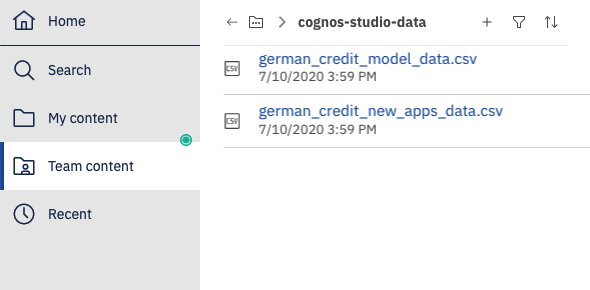

## 3. Create a new Watson Studio project

* Log into IBM's [Watson Studio](https://dataplatform.cloud.ibm.com). Once in, you'll land on the main dashboard.

* Create a new project by clicking `New project +` and then click on `Create an empty project`.

* Enter a project name.

* Choose an existing Object Storage instance or create a new one.

* Click the `Create` button.

Upon a successful project creation, you are taken to the project Overview tab. Take note of the Assets and Settings tabs, we'll be using them to associate our project with any external assets (datasets and notebooks) and any IBM cloud services.

  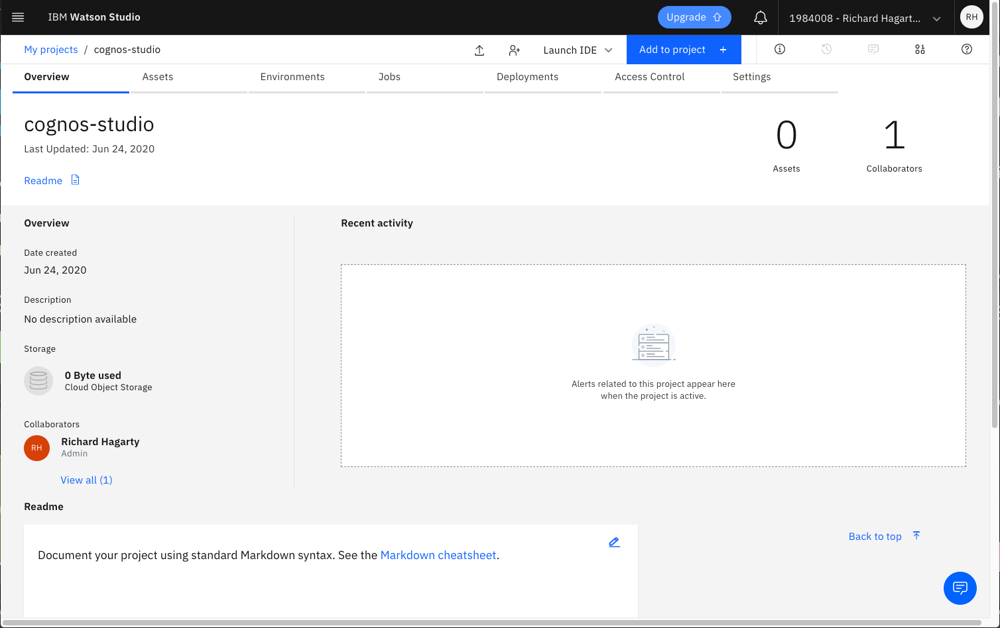

## 4. Create a Cognos Analytics connection in Watson Studio

* From you Watson Studio project dashboard, click `Add to project +`, and select the `Connection` option.

  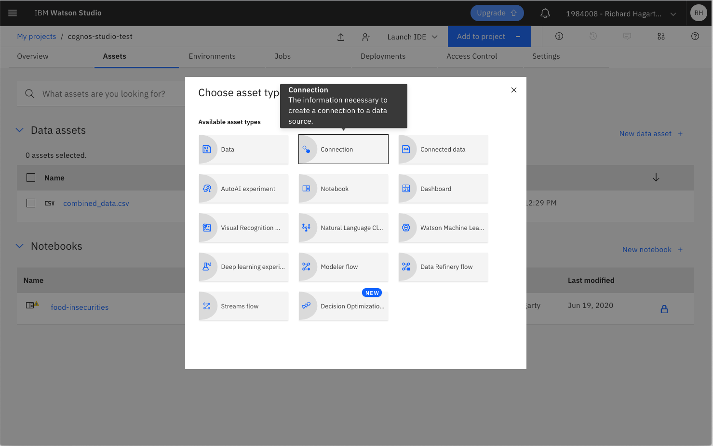

* Select `Cognos Analytics` as the data source.

  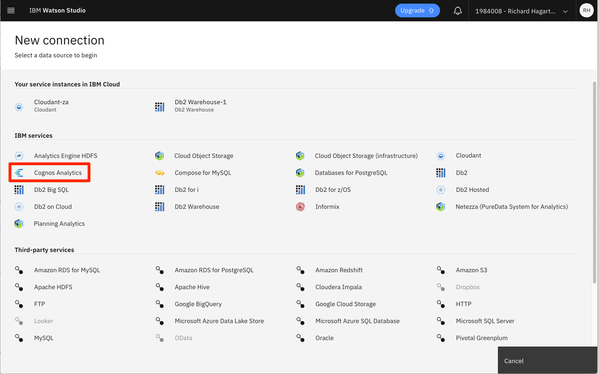

* Configure the connection to point to your Cognos Analytics instance. Provide a name for your connection, plus `namespace`, `username/password`, and `URL`.

  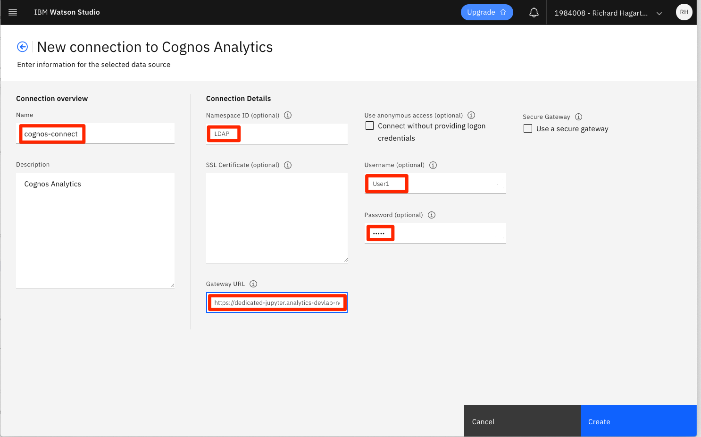

* Click the `Create` button.

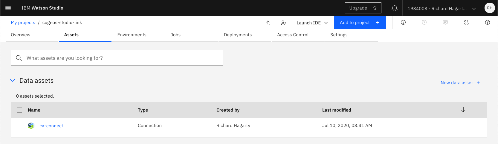

## 5. Create data access token

* From you Watson Studio project dashboard, selected the `Settings` tab.

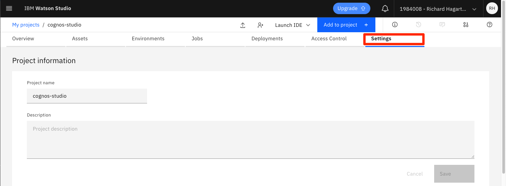

* Scroll down to the `Access tokens` list, and click on `New token +`.

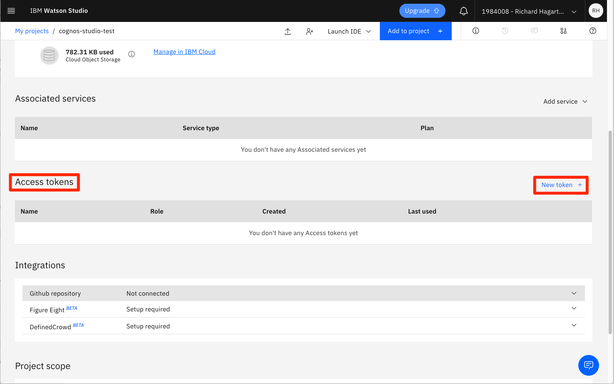

* Provide a name for your token and set the access level to `Editor`.

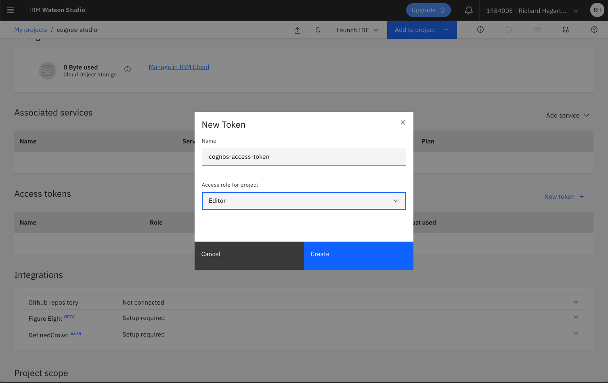

* Click the `Create` button.
* To view the token value, select the action menu located on the right-hand side of the token row, and click on `View`.

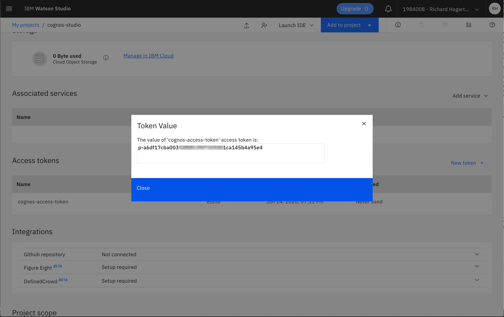

### 6. Create the notebook in Watson Studio

* From the new project `Overview` tab, click `+ Add to project` on the top right and choose the `Notebook` asset type.

  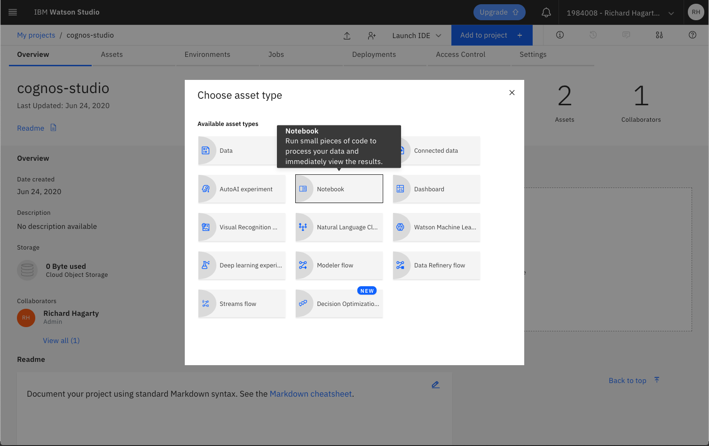

* Fill in the following information:

  * Select the `From URL` tab. [1]
  * Enter a `Name` for the notebook and optionally a description. [2]
  * For `Select runtime` select the `Default Python 3.6` option. [3]
  * Under `Notebook URL` provide the following url [4]:

  ```url
  https://raw.githubusercontent.com/IBM/cognos-analytics-with-watson-studio/master/notebooks/german-credit-risk.ipynb
  ```

  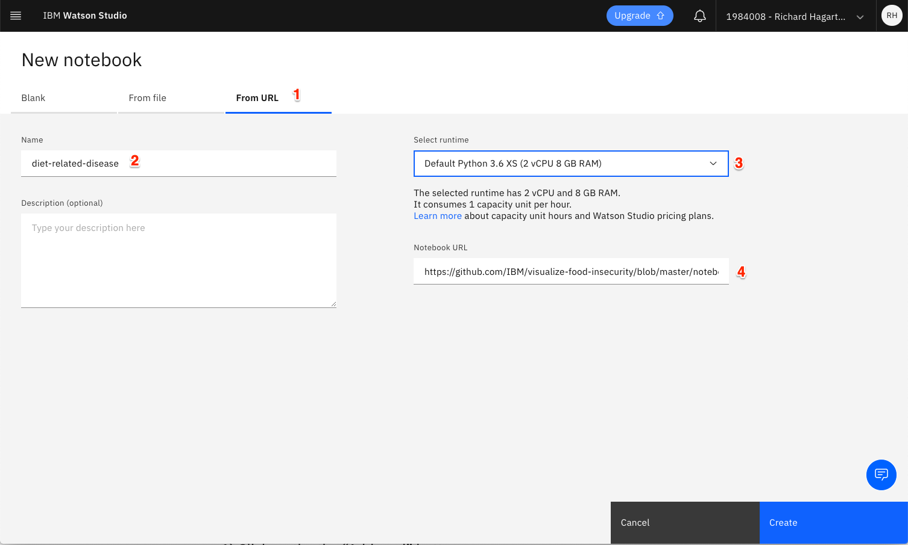

* Click the `Create` button.

  > **TIP:** Your notebook will appear in the `Notebooks` section of the `Assets` tab.

### 7. Add data to the notebook

* After creation, the notebook will automatically be loaded into the notebook runtime environment. You can re-run the notebook at any time by clicking on the `pencil` edit icon displayed in right-hand column of the notebook row.

  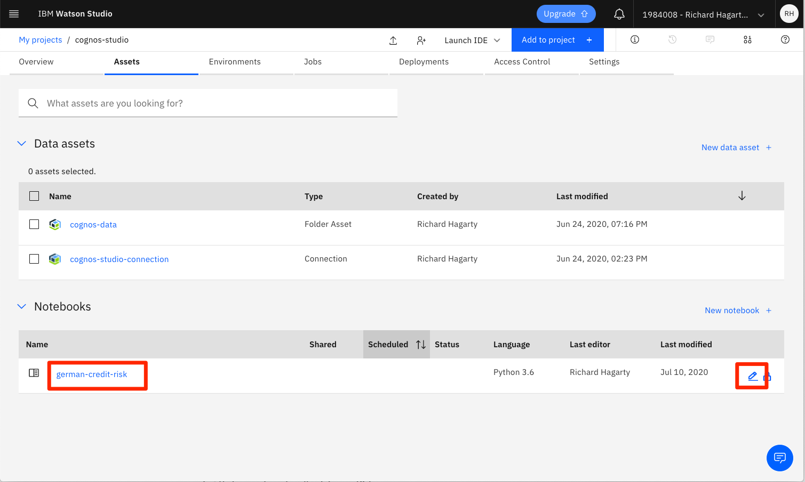

* The second cell of the notebook should be labeled as a `@hidden_cell`. This is where we will load in our Cognos Analytics `CSV` file.

  >**Note**: This cell is marked as a `@hidden_cell` because it will contain sensitive credentials.

* Use `Find and Add Data` (look for the 01/00 icon) and its `Connection` tab.

* Place your cursor at the bottom of the `@hidden_cell` (indicated by the red arrow), then select `insert to code`, and click on the `pandas DataFrame` option.

  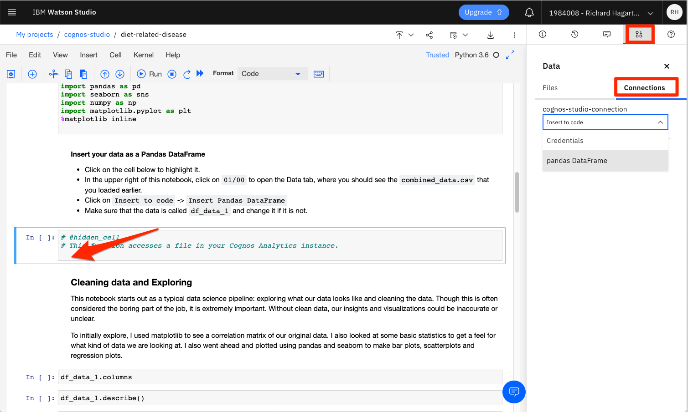

* The `@hidden_cell` should now contain the access token and data connector that will allow you to upload your Cognos Analytics `CSV` file.

  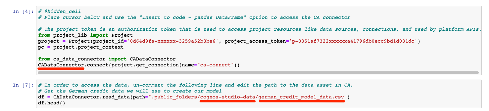

* In the next cell, change the path and file name to point to the German credit model data stored in Cognos Analytics.

  > **TIP**: To search the data files that your connector points to,  run the following command in the cell:
  >
  >```python
  >CADataConnector.search_data("keyword")
  >```

## 8. Run the notebook

When a notebook is executed, what is actually happening is that each code cell in the notebook is executed, in order, from top to bottom.

Each code cell is selectable and is preceded by a tag in the left margin. The tag format is `In [x]:`. Depending on the state of the notebook, the `x` can be:

* A blank, this indicates that the cell has never been executed.
* A number, this number represents the relative order this code step was executed.
* A `*`, this indicates that the cell is currently executing.

There are several ways to execute the code cells in your notebook:

* One cell at a time.
  * Select the cell, and then press the `Play` button in the toolbar.
* Batch mode, in sequential order.
  * From the `Cell` menu bar, there are several options available. For example, you can `Run All` cells in your notebook, or you can `Run All Below`, that will start executing from the first cell under the currently selected cell, and then continue executing all cells that follow.
* At a scheduled time.
  * Press the `Schedule` button located in the top right section of your notebook panel. Here you can schedule your notebook to be executed once at some future time, or repeatedly at your specified interval.

## 9. Refine the data and create a data model

Initially, the German credit risk dataset is very large and contains irrelevant data. Through a series of explorations, the DataFrame is reduced by eliminating unrelated variables and data where the vales are 0 or undefined.

The notebook also performs some data visualizations to find patterns, detect outliers, understand distribution and more. It uses graphs, such as:

* Histograms, boxplots, etc. to find distribution / spread of our continuous variables.
* Bar charts to show frequency in categorical values.

The notebook concludes by creating a machine learning model. It uses the  insights and intuition gained from the data visualizations to determine what kind of model to create and which features to use. The end result will be a simple classification model.

## 10. Write out data using Cognos Analytics connection

Once the model is created, we will use it to score a new set of credit applications.

First we need to upload the new application data from Cognos Analytics using our data connector.

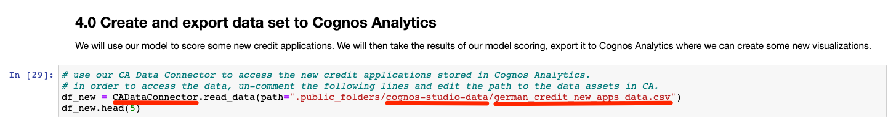

> **NOTE**: You will need to change the path and file name to point to the new German credit applications data in Cognos Analytics.

The new applications will be scored using our model, and a new DataFrame will be created that contains the result - whether the application is considered a credit risk or not.

Once the new scored DataFrame is created, we can use the data connector to write the data back out to Cognos Analytics for further investigation and data visulization.

In this example, we are writing it out to a file named `german_credit_new_apps_scored.csv`.

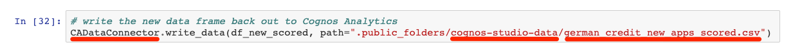

Once complete, you should see the file in the data folder of your Cognos Analytics instance.

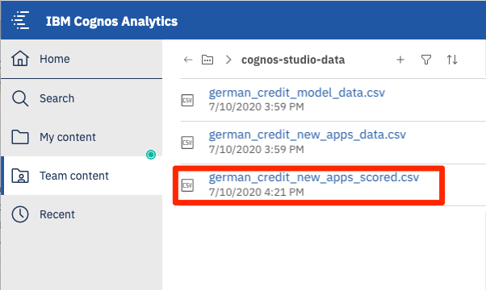

## 11. Visualize the data in Cognos Analytics

Log into your Cognos Analytics instance and navigate to your data directory that contains the German credit risk data, including the scored data we generated in the previous step.

### Create a data module

From the Cognos Analytics main dashboard, select the `+` icon in the lower left corner and select `Data module`.

From the file selection dialog, select the original German credit risk data we used to create the machine learning model, and the two files related to new credit applications. In this example, the file names are:

* `german_credit_model_data.csv` - the original data set used to create our scoring model.
* `german_credit_new_apps_data.csv` - new credit applications that are to be scored.
* `german_credit_new_apps_scored.csv` - new credit application scores.

  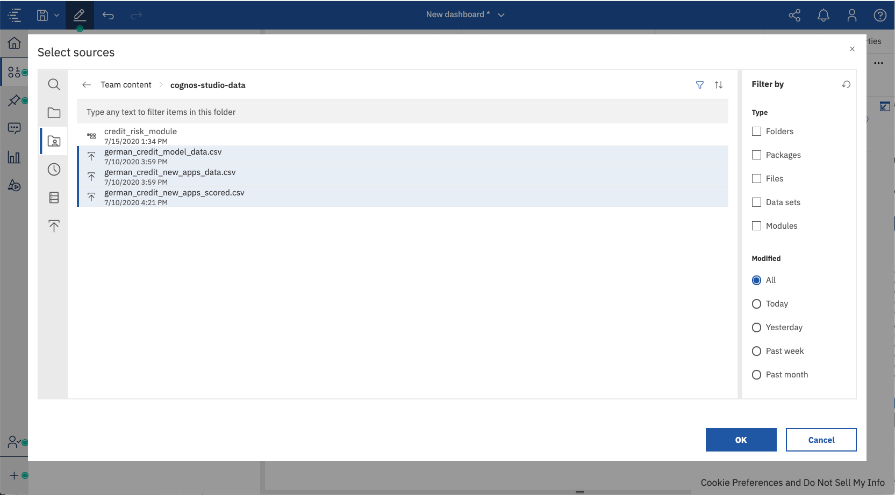

Click `OK`.

From the `Data module` panel, select the `Relationship` tabs. We need to create a link between the `german_credit_new_apps_data.csv` and `german_credit_new_apps_scored.csv` files. The new applications file contains all of the data used to determine risk, and the scored file just contains the result.

Right click on either file icon and select the option `Relationship...`.

  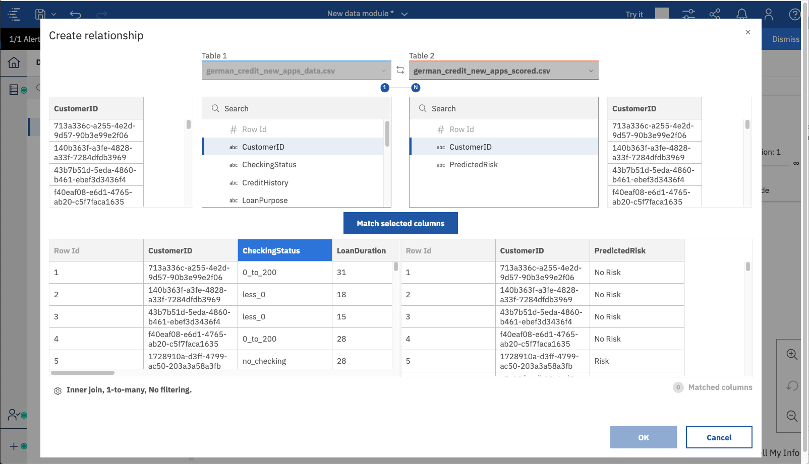

From the `Relationship` dialog, select the other file as `Table 2`. Then select the field `CustomerID` in both tables.

Click `Match Selected Columns`, then click `OK`.

  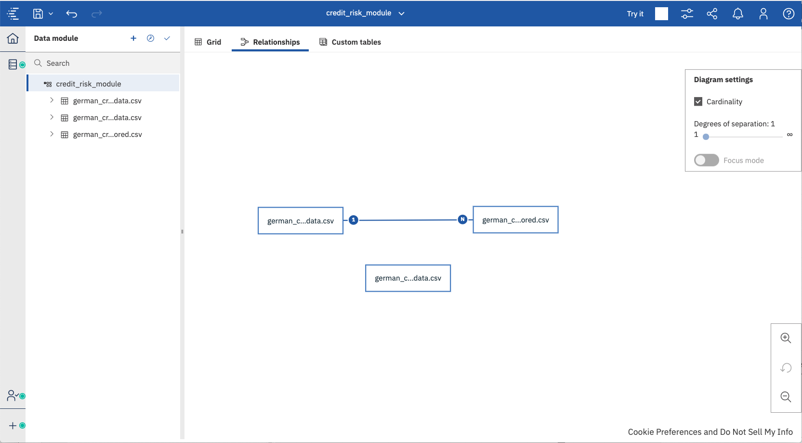

Click the `Save` icon in the top menu to name and save the `Data module`.

### Create a dashboard

From the Cognos Analytics main dashboard, select the `+` icon in the lower left corner and select `Dashboard`. Accept the default template and click `OK`.

Click `Select a source` to bring up the selction dialog. Select the `Data module` you just created in the previous step, and click `OK`.

You should then see a blank canvas to create your dashboard.

  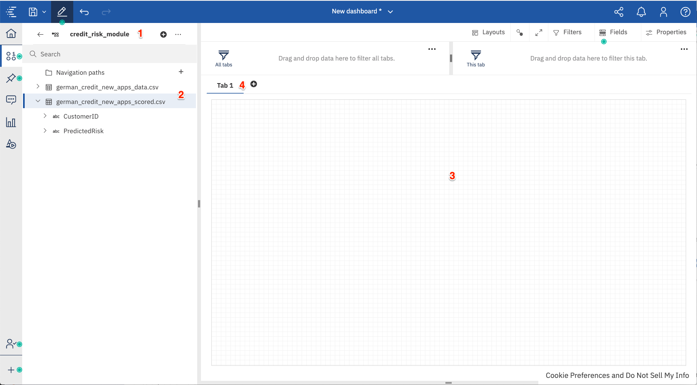

From the image above:

* [1] The data module currently associated with the dashboard.
* [2] The resources included in the data module.
* [3] The dashboard canvas.
* [4] The tabs defined for the dashboard.

To create your dashboard, you will need to become knowledgeable with the numerous tools available from icons and pop-up menus.

  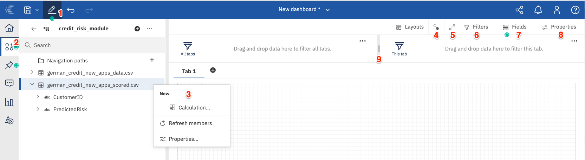

From the image above:

* [1] Toggles you between edit and preview mode.
* [2] Toggles display of the resouces (data objects) in the data module.
* [3] An example of one of many drop-down menus associated with data objects.
* [4] Displays the relationship between all of the visual objects on your dashboard. Objects with the same number are related.
* [5] Toggles full-screen mode on and off.
* [6] Toggles display of the filter panels.
* [7] Displays the fields associated with the selected visual object.
* [8] Displays the properties associated with the selected visual object.
* [9] Filters that can be applied to dashboard visual objects. The filter can be set for all dashboard tabs (left side), or for the current tab (right side).

The types of visualizations available include the following:

  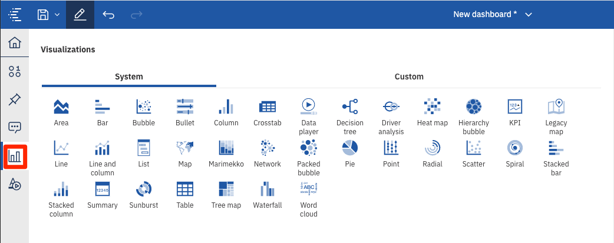

#### Spiral visualization to show main drivers to determine credit risk

Our first visualization we will be a spiral which will rank how important each of the drivers are in determining credit risk.

Select the `PredictedRisk` field in the `german_credit_risk_new_apps_scored` file in the data source list and drag it onto the canvas.

The toolbar at the top of the window is active for the currently selected visualization. For convenience, you can click on `Undock toolbar` to have the toolbar snap next to the selected visualization.

  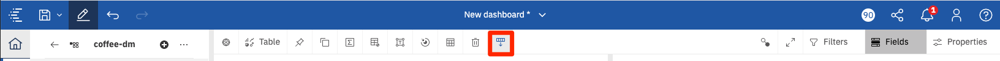.

Click on the anchor icon to bring up the toolbar for the visualization. Then click on the `Change visualization` tool. In this particular case, the default visualization choosen for the data type is a `table`. We need to change this to a `spiral`.

  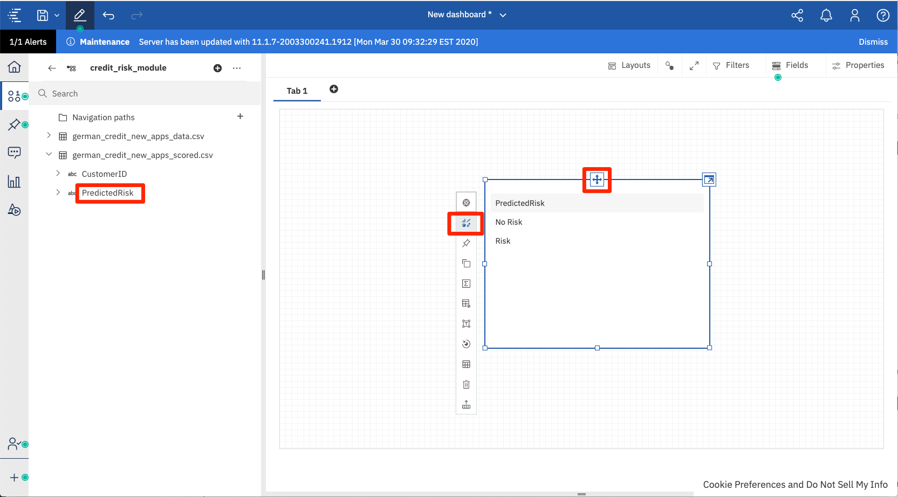

From the pop-up menu, click `All visualiztions` to open up the list of available visualizations. Select `spiral`.

  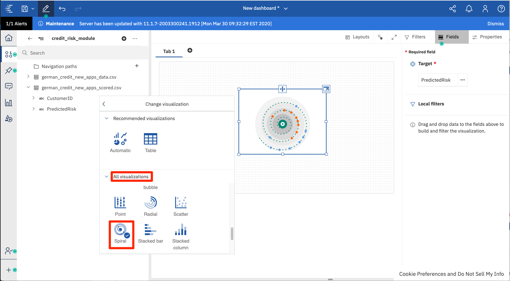

From the visualization toolbar, click on the `Edit the title` icon, and set the title to `Owns Property and Existing Savings is the best predictor of credit risk`.

  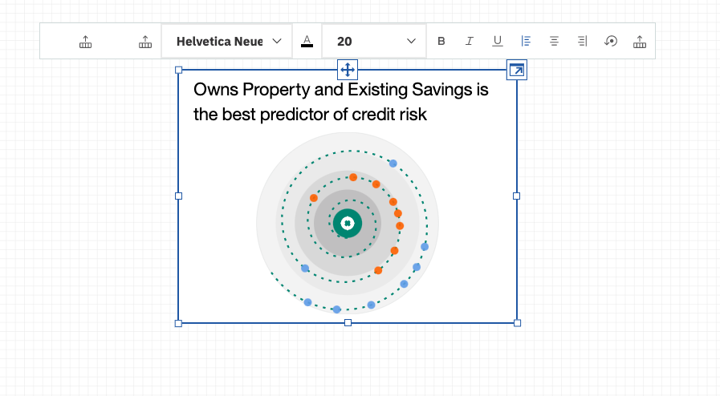

Use the box sizing tools to position the box in the upper left-hand corner of the dashboard.

Use the `Expand/Collapse` button in the upper right-hand corner of your visualization to view in expanded mode or to collapse the view in your dashboard canvas.

  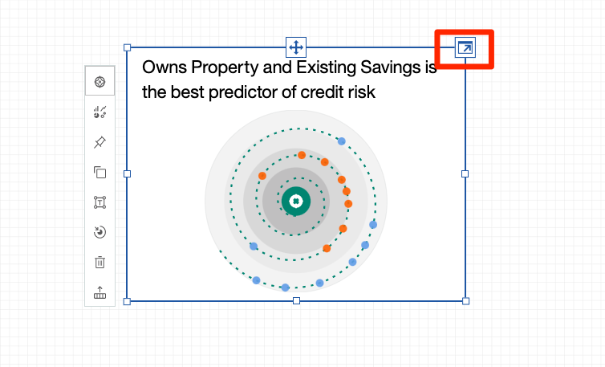

As you can see, the `spiral` visualization ranks the drivers that influence the target field - `PredictedRisk`.

  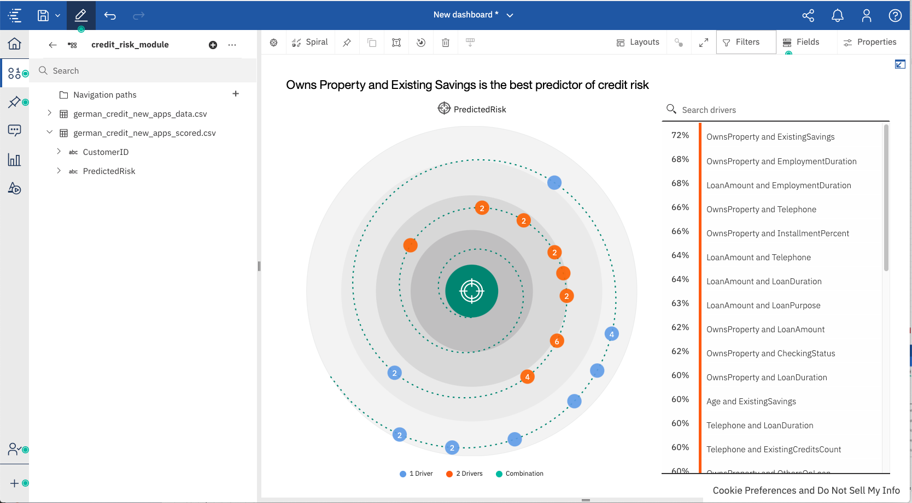

**NOTE**: Use the `Fields` tab to change what the visualization is based on, and use the `Properties` tab to modify the look and feel of the visualization.

  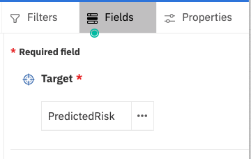

#### List visualization to show the effect of loan amount and loan length on risk

Next we will show what effect `Loan Amount` and `Loan Duration` have on credit risk.

Click the `Visualizations` icon in the left navigation bar and select the `Line` graph icon and drap it onto the canvas.

With the new visualization selected, click on the `Fields` tab.

Going back to our resource list, from the `german_credit_risk_new_apps_data` file, drag `LoanAmount` to the `x-axis` field, and `LoanDuration` to the `y-axis` field.

From the `german_credit_risk_new_apps_scored` file, drap `PredictedRisk` onto the visualization, which should assign it to the `Color` field.

  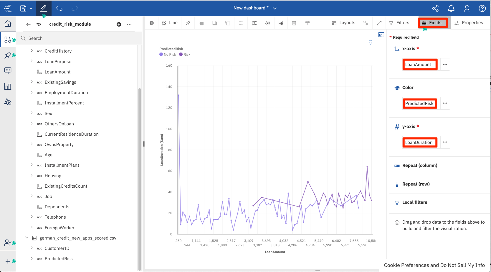

If desired, you can use the `Change color palatte` option under the `Properties` tab to change the line colors.

  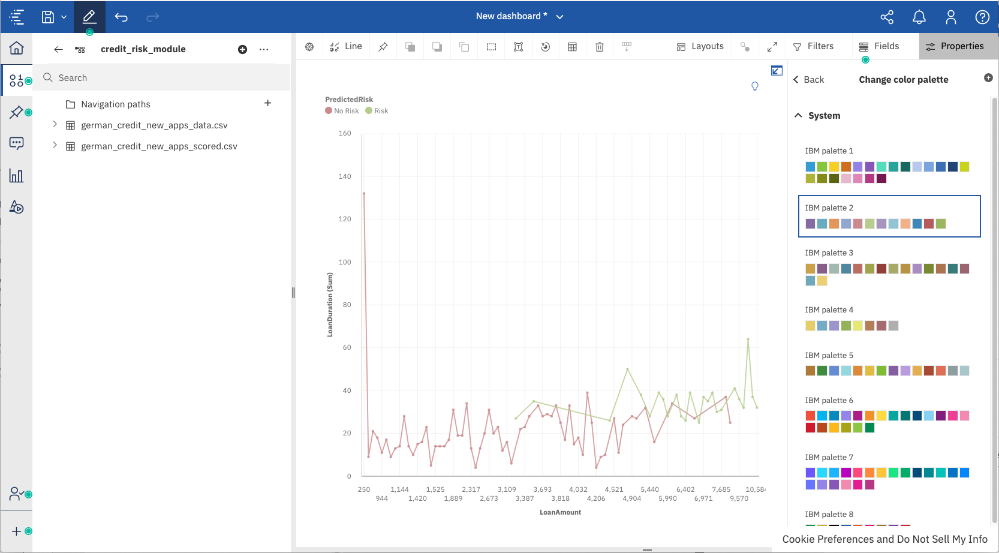

As the graph indicates, the higher the loan amount and the longer the length of the loan, the higer the risk.

Change the title of the visualization to `Loan amount and duration vs predicted risk`.

#### Decision Tree visualization

Our last visualization will be to show the associated risk factors related to the original German credit dataset that had an assigned risk value for each applicant.

Select the `Risk` field in the `german_credit_risk_model_data` file in the data source list and drag it onto the canvas.

Change the visualization to a `Decision tree`.

  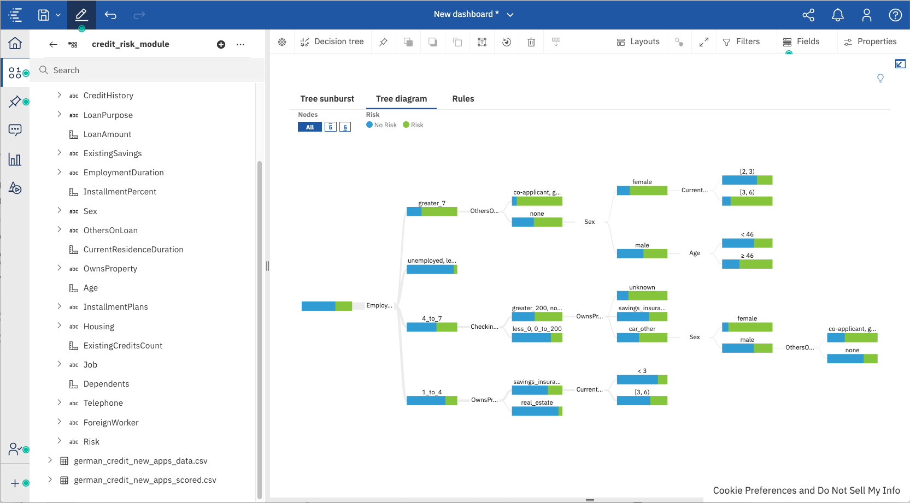

As you can see, all possible `Employment` values are expanded to show risk when combined with other factors.

Change the title of the visualization to `Historic risk drivers`.

#### Final dashboard

Here is what the final version of the dashboard should look like:

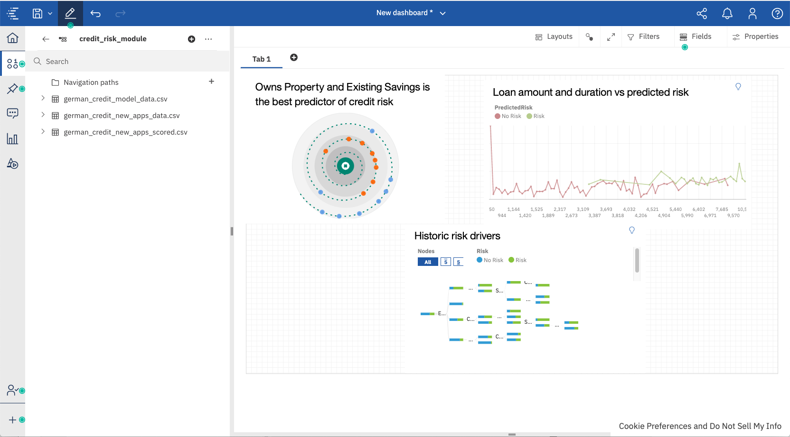

Now that you understand `Data Modules` and `Dashboards`, feel free to explore new visualziations using the German credit risk data.

## License

This code pattern is licensed under the Apache Software License, Version 2.  Separate third party code objects invoked within this code pattern are licensed by their respective providers pursuant to their own separate licenses. Contributions are subject to the [Developer Certificate of Origin, Version 1.1 (DCO)](https://developercertificate.org/) and the [Apache Software License, Version 2](https://www.apache.org/licenses/LICENSE-2.0.txt).

[Apache Software License (ASL) FAQ](https://www.apache.org/foundation/license-faq.html#WhatDoesItMEAN)
